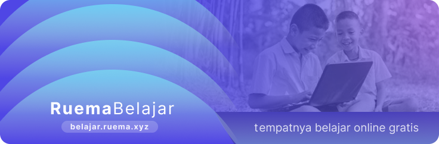

import { LinkCard, CardGrid } from '@astrojs/starlight/components';

  

> Belajar secara daring (online) telah menjadi metode pembelajaran yang semakin populer dan fleksibel, memungkinkan akses ke beragam materi pelajaran dan keterampilan sesuai dengan keinginan dan kebutuhan.

*Ruema Belajar* adalah salah satu wadah yang membantu kamu untuk menemukan beragam tempat belajar online gratis yang rekomended berdasarkan keinginan dan kebutuhan. 

Tidak hanya itu kami juga sedang mulai merancang beragam pelajaran menarik untuk dipelajari yang ditulis oleh [orang dalam ruema](/kontribusi/#kontributor).

:::note[Tahu Gak?]
Sekolah adalah sebuah tempat kita bisa belajar tapi tak semua pelajaran bisa kita dapatkan disekolah dan pelajaran itu akan kita dapatkan bertahap dimulai sejak kita keluar dari pintu sekolah
:::

## Menggali Potensi Diri 

Dalam perjalanan hidup ini, kita seringkali dihadapkan pada peluang dan tantangan yang membutuhkan pengetahuan, keterampilan, dan pemahaman baru. Terlepas dari usia, latar belakang, atau situasi, keinginan untuk terus belajar adalah sifat manusiawi yang tak terelakkan. Proses belajar bukan hanya tentang mendapatkan gelar atau memenuhi tuntutan akademis, tetapi juga tentang penemuan diri, pertumbuhan pribadi, dan kemajuan dalam berbagai aspek kehidupan.

Tidak terlepas siapapun diri anda, Apakah Anda seorang pelajar, profesional, ibu rumah tangga, atau siapa pun yang merasa bahwa ada ruang untuk perkembangan lebih lanjut, Ruema Belajar hadir untuk Anda. Tak peduli sejauh mana Anda telah berada dalam perjalanan belajar Anda, mengembangkan kemampuan dan pengetahuan baru memiliki potensi untuk merubah cara Anda melihat dunia dan menghadapi tantangan.

Tak kenal maka tak tahu, Yuk kenali diri anda lewat tes ini:
<LinkCard
	title="01. Tes Mengenal diri"
	href="https://satupersen.net/quiz/tes-kepribadian-mbti"
/>
<LinkCard
	title="02. Profesi atau Pekerjaan yang cocok untuk diri saya"
	href="https://satupersen.net/blog/cara-memilih-pekerjaan-sesuai-kepribadian-dengan-tes-mbti"
/>
<LinkCard
	title="03. Topik belajar untuk saya"
	href="/belajar/topik"
/>